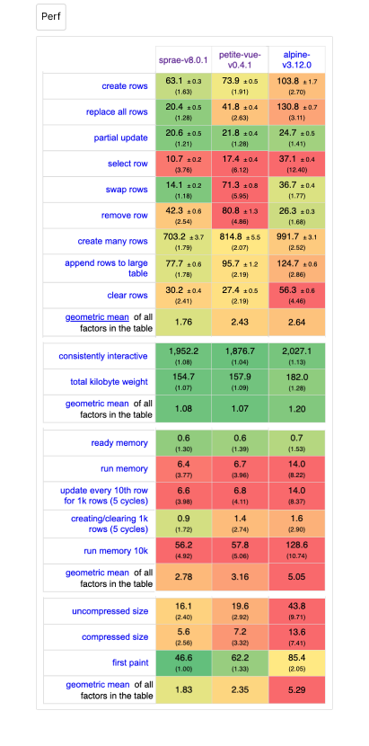

# ∴ spræ [](https://github.com/dy/sprae/actions/workflows/node.js.yml) [](https://bundlephobia.com/package/sprae) [](https://npmjs.org/sprae)

> DOM tree microhydration

_Sprae_ is open & minimalistic progressive enhancement framework, a light alternative to alpine, petit-vue etc.<br/>
Perfect for small-scale websites, static pages, landings, prototypes, or lightweight UI.<br/>

## Usage

```html
<div id="container" :if="user">
  Hello <span :text="user.name">World</span>.
</div>

<script type="module">
  import sprae from 'sprae'

  // init
  const state = sprae(container, { user: { name: 'Kitty' } })

  // update
  state.user.name = 'Dolly'
</script>
```

Sprae evaluates `:`-directives and evaporates them, returning reactive state for updates.

## Directives

#### `:if="condition"`, `:else`

Control flow of elements.

```html
<span :if="foo">foo</span>
<span :else :if="bar">bar</span>
<span :else>baz</span>

<!-- fragment -->
<template :if="foo">foo <span>bar</span> baz</template>
```


#### `:each="item, index? in items"`

Multiply element.

```html
<ul><li :each="item in items" :text="item"/></ul>

<!-- cases -->
<li :each="item, idx in array" />
<li :each="value, key in object" />
<li :each="count, idx in number" />

<!-- fragment -->
<template :each="item in items">
  <dt :text="item.term"/>
  <dd :text="item.definition"/>
</template>
```

#### `:text="value"`

Set text content of an element.

```html
Welcome, <span :text="user.name">Guest</span>.

<!-- fragment -->
Welcome, <template :text="user.name" />.
```

#### `:class="value"`

Set class value.

```html
<!-- appends class -->
<div class="foo" :class="bar"></div>

<!-- array/object, a-la clsx -->
<div :class="[foo && 'foo', {bar: bar}]"></div>
```

#### `:style="value"`

Set style value.

```html
<!-- extends style -->
<div style="foo: bar" :style="'baz: qux'">

<!-- object -->
<div :style="{foo: 'bar'}"></div>

<!-- CSS variable -->
<div :style="{'--baz': qux}"></div>
```

#### `:value="value"`

Set value of an input, textarea or select.

```html
<input :value="value" />
<textarea :value="value" />

<!-- selects right option & handles selected attr -->
<select :value="selected">
  <option :each="i in 5" :value="i" :text="i"></option>
</select>

<!-- handles checked attr -->
<input type="checkbox" :value="checked" />
```

#### `:<prop>="value"`, `:="values"`

Set any attribute(s).

```html
<label :for="name" :text="name" />

<!-- multiple attributes -->
<input :id:name="name" />

<!-- spread attributes -->
<input :="{ id: name, name, type: 'text', value }" />
```

#### `:with="values"`

Define values for a subtree.

```html
<x :with="{ foo: 'bar' }">
  <y :with="{ baz: 'qux' }" :text="foo + baz"></y>
</x>
```

#### `:ref="name"`

Expose element with `name`.

```html
<textarea :ref="text" placeholder="Enter text..."></textarea>

<!-- iterable items -->
<li :each="item in items" :ref="item">
  <input :onfocus..onblur="e => (item.classList.add('editing'), e => item.classList.remove('editing'))"/>
</li>
```

#### `:fx="code"`

Run effect, not changing any attribute.

```html
<div :fx="a.value ? foo() : bar()" />

<!-- cleanup function -->
<div :fx="id = setInterval(tick, interval), () => clearInterval(tick)" />
```

#### `:on<event>="handler"`, `:on<in>..on<out>="handler"`

Attach event(s) listener with optional modifiers.

```html
<input type="checkbox" :onchange="e => isChecked = e.target.value">

<!-- multiple events -->
<input :value="text" :oninput:onchange="e => text = e.target.value">

<!-- sequence of events -->
<button :onfocus..onblur="e => ( handleFocus(), e => handleBlur())">

<!-- modifiers -->
<button :onclick.throttle-500="handler">Not too often</button>
```

##### Modifiers:

* `.once`, `.passive`, `.capture` – listener [options](https://developer.mozilla.org/en-US/docs/Web/API/EventTarget/addEventListener#options).
* `.prevent`, `.stop` (`.immediate`) – prevent default or stop (immediate) propagation.
* `.window`, `.document`, `.outside`, `.self` – specify event target.
* `.throttle-<ms>`, `.debounce-<ms>` – defer function call with one of the methods.
* `.<key>` – filtered by [`event.key`](https://developer.mozilla.org/en-US/docs/Web/API/UI_Events/Keyboard_event_key_values):
  * `.ctrl`, `.shift`, `.alt`, `.meta`, `.enter`, `.esc`, `.tab`, `.space` – direct key
  * `.delete` – delete or backspace
  * `.arrow` – up, right, down or left arrow
  * `.digit` – 0-9
  * `.letter` – A-Z, a-z or any [unicode letter](https://unicode.org/reports/tr18/#General_Category_Property)
  * `.char` – any non-space character
  * `.ctrl-<key>, .alt-<key>, .meta-<key>, .shift-<key>` – key combinations, eg. `.ctrl-alt-delete` or `.meta-x`.
* `.*` – any other modifier has no effect, but allows binding multiple handlers to same event (like jQuery event classes).

#### `:data="values"` 🔌

> Include as `import 'sprae/directive/data'`.

Set `data-*` attributes. CamelCase is converted to dash-case.

```html
<input :data="{foo: 1, barBaz: true}" />
<!-- <input data-foo="1" data-bar-baz /> -->
```

#### `:aria="values"` 🔌

> Include as `import 'sprae/directive/aria'`.

Set `aria-*` attributes. Boolean values are stringified.

```html
<input role="combobox" :aria="{
  controls: 'joketypes',
  autocomplete: 'list',
  expanded: false,
  activeOption: 'item1',
  activedescendant: ''
}" />
<!--
<input role="combobox" aria-controls="joketypes" aria-autocomplete="list" aria-expanded="false" aria-active-option="item1" aria-activedescendant>
-->
```


#### `:html="element"` 🔌 (experimental)

> Include as `import 'sprae/directive/html'`.

Set html content of an element or instantiate a template.

```html
Hello, <span :html="userElement">Guest</span>.

<!-- fragment -->
Hello, <template :html="user.name">Guest</template>.

<!-- instantiate template -->
<template :ref="tpl"><span :text="foo"></span></template>
<div :html="tpl" :with="{foo:'bar'}">...inserted here...</div>
```

<!--
#### `:onvisible..oninvisible="e => e => {}"`

Trigger when element is in/out of the screen.

```html
<div :onvisible..oninvisible="e => (
  e.target.classList.add('visible'),
  e => e.target.classlist.remove('visible')
)"/>
```

#### `:onmount..onunmount="e => e => {}"`

Trigger when element is connected / disconnected from DOM.

```html
<div :onmount..onunmount="e => (dispose = init(), e => dispose())"/>
```
-->

## Signals

Sprae uses signals for reactivity and can take signal values as inputs.
Signals provider can be switched to any preact-flavored implementation:

```js
import sprae from 'sprae';
import { signal, computed, effect, batch, untracked } from 'sprae/signal';
import * as signals from '@preact/signals-core';

// switch provider to @preact/signals-core
sprae.use(signals);

// use signal as state value
const name = signal('Kitty')
sprae(el, { name });

// update state
name.value = 'Dolly';
```

Provider | Size | Feature
:---|:---|:---
[`ulive`](https://ghub.io/ulive) (default) | 350b | Minimal implementation, basic performance, good for small states.
[`@webreflection/signal`](https://ghib.io/@webreflection/signal) | 531b | Class-based, better performance, good for small-medium states.
[`usignal`](https://ghib.io/usignal) | 850b | Class-based with optimizations, good for medium states.
[`@preact/signals-core`](https://ghub.io/@preact/signals-core) | 1.47kb | Best performance, good for any states, industry standard.
[`signal-polyfill`](https://github.com/proposal-signals/signal-polyfill) | 2.5kb | Proposal signals. Use via [adapter](https://gist.github.com/dy/bbac687464ccf5322ab0e2fd0680dc4d).

## Untracked

Properties prefixed with `_` indicate untracked value:

```js
let state = sprae(el, {x:1, _y:2})
state.x++ // updates template
state._y++ // no side-effect
```

## Evaluator

Expressions use _new Function_ as default evaluator, which is fast & compact way, but violates "unsafe-eval" CSP.
To make eval stricter & safer, as well as sandbox expressions, an alternative evaluator can be used, eg. _justin_:

```js
import sprae from 'sprae'
import justin from 'subscript/justin'

sprae.use({compile: justin}) // set up justin as default compiler
```

[_Justin_](https://github.com/dy/subscript?tab=readme-ov-file#justin) is minimal JS subset that avoids "unsafe-eval" CSP and provides sandboxing.

###### Operators:

`++ -- ! - + ** * / %  && || ??`<br/>
`= < <= > >= == != === !==`<br/>
`<< >> & ^ | ~ ?: . ?. [] ()=>{} in`

###### Primitives:

`[] {} "" ''`<br/>
`1 2.34 -5e6 0x7a`<br/>
`true false null undefined NaN`


## Custom Build

_Sprae_ can be tailored to project needs via `sprae/core`:

```js
// sprae.custom.js
import sprae, { directive } from 'sprae/core'
import { effect } from 'sprae/signal'
import * as signals from '@preact/signals'
import compile from 'subscript'

// standard directives
import 'sprae/directive/default.js'
import 'sprae/directive/if.js'
import 'sprae/directive/text.js'

// custom directive :id="expression"
directive.id = (el, evaluate, state) => {
  effect(() => el.id = evaluate(state))
}

// configure signals
sprae.use(signals)

// configure compiler
sprae.use({ compile })
```

## Hints

* To prevent [FOUC](https://en.wikipedia.org/wiki/Flash_of_unstyled_content) add `<style>[:each],[:if],[:else] {visibility: hidden}</style>`
* Attributes order matters, eg. `<li :each="el in els" :text="el.name"></li>` is not the same as `<li :text="el.name" :each="el in els"></li>`
* To destroy state and detach sprae handlers, call `element[Symbol.dispose]()`.
* State getters/setters work as computed effects, eg. `sprae(el, { x:1, get x2(){ return this.x * 2} })`.
* `this` keyword is not used, to get access to current element use `<input :ref="el" :text="el.value"/>`
* Async/await is not supported in attributes, it's a strong indicator you need to put these methods into state.

## Justification

* [Template-parts](https://github.com/dy/template-parts) is stuck with native HTML quirks ([parsing table](https://github.com/github/template-parts/issues/24), [SVG attributes](https://github.com/github/template-parts/issues/25), [liquid syntax](https://shopify.github.io/liquid/tags/template/#raw) conflict etc).
* [Alpine](https://github.com/alpinejs/alpine) / [petite-vue](https://github.com/vuejs/petite-vue) / [lucia](https://github.com/aidenyabi/lucia) escape native HTML quirks, but have excessive API (`:`, `x-`, `{}`, `@`, `$`), tend to [self-encapsulate](https://github.com/alpinejs/alpine/discussions/3223) and not care about size/performance.

_Sprae_ holds open, sweet & minimalistic philosophy:
* Slim `:` API and _signals_ reactivity.
* Pluggable directives & configurable internals.
* Small, safe & performant.
* Bits of organic sugar.
* Aims at making developers happy 🫰

<!--
|                       | [AlpineJS](https://github.com/alpinejs/alpine)          | [Petite-Vue](https://github.com/vuejs/petite-vue)        | Sprae            |
|-----------------------|-------------------|-------------------|------------------|
| _Size_              | ~10KB             | ~6KB              | ~5KB             |
| _Memory_            | 5.05             | 3.16              | 2.78             |
| _Performance_       | 2.64             | 2.43              | 1.76             |
| _CSP_               | Limited                | No                | Yes              |
| _SSR_ | No | No | No |
| _Evaluation_        | [`new AsyncFunction`](https://github.com/alpinejs/alpine/blob/main/packages/alpinejs/src/evaluator.js#L81) | [`new Function`](https://github.com/vuejs/petite-vue/blob/main/src/eval.ts#L20) | [`new Function`]() / [justin](https://github.com/dy/subscript)           |
| _Reactivity_        | `Alpine.store`    | _@vue/reactivity_   | _signals_ |
| _Sandboxing_        | No                | No                | Yes              |
| _Directives_ | `:`, `x-`, `{}` | `:`, `v-`, `@`, `{}` | `:` |
| _Magic_               | `$data` | `$app`   | - |
| _Fragments_ | Yes | No | Yes |
| _Plugins_ | Yes | No | Yes |
| _Modifiers_ | Yes | No | Yes |
-->

<!--
<details>
<summary><strong>Benchmark</strong></summary>

See [js-framework-benchmark](https://krausest.github.io/js-framework-benchmark/current.html#eyJmcmFtZXdvcmtzIjpbIm5vbi1rZXllZC9wZXRpdGUtdnVlIiwibm9uLWtleWVkL3NwcmFlIl0sImJlbmNobWFya3MiOlsiMDFfcnVuMWsiLCIwMl9yZXBsYWNlMWsiLCIwM191cGRhdGUxMHRoMWtfeDE2IiwiMDRfc2VsZWN0MWsiLCIwNV9zd2FwMWsiLCIwNl9yZW1vdmUtb25lLTFrIiwiMDdfY3JlYXRlMTBrIiwiMDhfY3JlYXRlMWstYWZ0ZXIxa194MiIsIjA5X2NsZWFyMWtfeDgiLCIyMV9yZWFkeS1tZW1vcnkiLCIyMl9ydW4tbWVtb3J5IiwiMjNfdXBkYXRlNS1tZW1vcnkiLCIyNV9ydW4tY2xlYXItbWVtb3J5IiwiMjZfcnVuLTEway1tZW1vcnkiLCIzMV9zdGFydHVwLWNpIiwiMzRfc3RhcnR1cC10b3RhbGJ5dGVzIiwiNDFfc2l6ZS11bmNvbXByZXNzZWQiLCI0Ml9zaXplLWNvbXByZXNzZWQiXSwiZGlzcGxheU1vZGUiOjF9).


</details>
-->

<!--
<details>
<summary>How to run</summary>

```sh
# prerequisite
npm ci
npm run install-server
npm start

# build
cd frameworks/non-keyed/sprae
npm ci
npm run build-prod

# bench
[cd ../../../webdriver-ts
npm ci
npm run compile]
npm run bench keyed/sprae

# show results
[cd ../webdriver-ts-results
npm ci]
cd ../webdriver-ts
npm run results
```
</details>
-->

<!-- ## See also -->

<!--
## Alternatives

* [Alpine](https://github.com/alpinejs/alpine)
* ~~[Lucia](https://github.com/aidenybai/lucia)~~ deprecated
* [Petite-vue](https://github.com/vuejs/petite-vue)
* [nuejs](https://github.com/nuejs/nuejs)
 -->


## Examples

* ToDo MVC: [demo](https://dy.github.io/sprae/examples/todomvc), [code](https://github.com/dy/sprae/blob/main/examples/todomvc.html)
* JS Framework Benchmark: [demo](https://dy.github.io/sprae/examples/js-framework-benchmark), [code](https://github.com/dy/sprae/blob/main/examples/js-framework-benchmark.html)
* Wavearea: [demo](https://dy.github.io/wavearea?src=//cdn.freesound.org/previews/586/586281_2332564-lq.mp3), [code](https://github.com/dy/wavearea)
* Carousel: [demo](https://rwdevelopment.github.io/sprae_js_carousel/), [code](https://github.com/RWDevelopment/sprae_js_carousel)
* Tabs: [demo](https://rwdevelopment.github.io/sprae_js_tabs/), [code](https://github.com/RWDevelopment/sprae_js_tabs?tab=readme-ov-file)
* Prostogreen [demo](http://web-being.org/prostogreen/), [code](https://github.com/web-being/prostogreen/)

<!--
## See Also

* [nadi](https://github.com/dy/nadi) - 101 signals. -->


<p align="center"><a href="https://github.com/krsnzd/license/">🕉</a></p>
