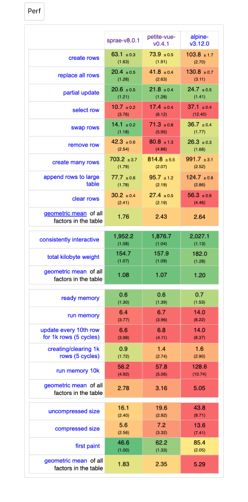

# ∴ spræ [](https://github.com/dy/sprae/actions/workflows/node.js.yml) [](https://bundlephobia.com/package/sprae) [](https://www.npmjs.com/package/sprae)

<em>S</em>imple <em>pr</em>ogressive <em>æ</em>nhancement for DOM or JSX.<br/>

[Website](https://dy.github.io/sprae) · [Docs](https://dy.github.io/sprae/docs) · [Examples](https://dy.github.io/sprae/drops)


## Usage

```html
<div id="counter" :scope="{ count: 0 }">
  <p :text="`Clicked ${count} times`"></p>
  <button :onclick="count++">Click me</button>
</div>

<script src="https://cdn.jsdelivr.net/npm/sprae@12.x.x/dist/sprae.umd.js" start></script>
```

Sprae enables reactivity via `:`-directives.

<!--
## Concepts

**Directives** are `:` prefixed attributes that evaluate JavaScript expressions:
`<div :text="message"></div>`

**Reactivity** happens automatically through signals when values change:
`<button :onclick="count++">` updates `<span :text="count">`

**Scope** is a state container for a subtree:
`<div :scope="{ user: 'Alice' }">` makes `user` available to children

**Modifiers** adjust directive behavior:
`:oninput.debounce-200` delays handler by 200ms

**Effects** run side effects whenever value changes:
`:fx="console.log(count)"` logs when `count` changes
-->

<!--
### Flavors

* [sprae.js](dist/sprae.js) – ESM.
* [sprae.umd.js](dist/sprae.umd.js) – CJS / UMD / standalone with autoinit.
* [sprae.micro.js](dist/sprae.micro.js) – <2.5kb [micro version](#micro).
-->
<!-- * sprae.async.js - sprae with async events -->
<!-- * sprae.alpine.js - alpine sprae, drop-in alpinejs replacement -->
<!-- * sprae.vue.js - vue sprae, drop-in petite-vue replacement -->
<!-- * sprae.preact.js - sprae with preact-signals -->


<!--
## FAQ

1. Errors handling?
2. Typescript support?
3. Performance tips?
-->

## Justification

Modern frontend is like processed food – heavy, unhealthy and make you feel bloated.
Frameworks come with heavy tooling, laborous setups, configs, proprietary conventions, artificial abstractions and ecosystem lock-in. Not care about progressive enhancement is anachronism.

Native [template-parts](https://github.com/github/template-parts) and [DCE](https://github.com/WICG/webcomponents/blob/gh-pages/proposals/Declarative-Custom-Elements-Strawman.md) give hope, but stuck with HTML quirks [1](https://github.com/github/template-parts/issues/24), [2](https://github.com/github/template-parts/issues/25), [3](https://shopify.github.io/liquid/tags/template/#raw).

[Alpine](https://github.com/alpinejs/alpine) and [petite-vue](https://github.com/vuejs/petite-vue) offer PE, but reserve unnecessary syntax space (x-, @, $, etc.), tend to [self-encapsulate](https://github.com/alpinejs/alpine/discussions/3223) which complicates integration, limit extensibility and not care about size / performance.

_Sprae_ holds open, safe, minimalistic philosophy:

* One `:` prefix. Zero magic.
* Valid HTML. Non-obtrusive.
* Signals for reactivity
* Configurable signals, evaluator, directives, modifiers.
* Build-free, ecosystem-agnostic.
* Small, safe & fast.
* 🫰 developers

Perfect for small websites, static pages, prototypes, landings, SPA, PWA, JSX / SSR, micro-frontends, github pages, or anywhere where you need lightweight UI.

<!--
|                       | [AlpineJS](https://github.com/alpinejs/alpine)          | [Petite-Vue](https://github.com/vuejs/petite-vue)        | Sprae            |
|-----------------------|-------------------|-------------------|------------------|
| _Size_              | ~10KB             | ~6KB              | ~5KB             |
| _Memory_            | 5.05             | 3.16              | 2.78             |
| _Performance_       | 2.64             | 2.43              | 1.76             |
| _CSP_               | Limited                | No                | Yes              |
| _SSR_ | No | No | No |
| _Evaluation_        | [`new AsyncFunction`](https://github.com/alpinejs/alpine/blob/main/packages/alpinejs/src/evaluator.js#L81) | [`new Function`](https://github.com/vuejs/petite-vue/blob/main/src/eval.ts#L20) | [`new Function`]() / [justin](https://github.com/dy/subscript)           |
| _Reactivity_        | `Alpine.store`    | _@vue/reactivity_   | _signals_ |
| _Sandboxing_        | No                | No                | Yes              |
| _Directives_ | `:`, `x-`, `{}` | `:`, `v-`, `@`, `{}` | `:` |
| _Magic_               | `$data` | `$app`   | - |
| _Fragments_ | Yes | No | Yes |
| _Plugins_ | Yes | No | Yes |
| _Modifiers_ | Yes | No | Yes |

_Nested directives_ Yes
_Inline directives_ Yes
-->

<!--
<details>
<summary><strong>Benchmark</strong></summary>

See [js-framework-benchmark](https://krausest.github.io/js-framework-benchmark/current.html#eyJmcmFtZXdvcmtzIjpbIm5vbi1rZXllZC9wZXRpdGUtdnVlIiwibm9uLWtleWVkL3NwcmFlIl0sImJlbmNobWFya3MiOlsiMDFfcnVuMWsiLCIwMl9yZXBsYWNlMWsiLCIwM191cGRhdGUxMHRoMWtfeDE2IiwiMDRfc2VsZWN0MWsiLCIwNV9zd2FwMWsiLCIwNl9yZW1vdmUtb25lLTFrIiwiMDdfY3JlYXRlMTBrIiwiMDhfY3JlYXRlMWstYWZ0ZXIxa194MiIsIjA5X2NsZWFyMWtfeDgiLCIyMV9yZWFkeS1tZW1vcnkiLCIyMl9ydW4tbWVtb3J5IiwiMjNfdXBkYXRlNS1tZW1vcnkiLCIyNV9ydW4tY2xlYXItbWVtb3J5IiwiMjZfcnVuLTEway1tZW1vcnkiLCIzMV9zdGFydHVwLWNpIiwiMzRfc3RhcnR1cC10b3RhbGJ5dGVzIiwiNDFfc2l6ZS11bmNvbXByZXNzZWQiLCI0Ml9zaXplLWNvbXByZXNzZWQiXSwiZGlzcGxheU1vZGUiOjF9).


</details>
-->

<!--
<details>
<summary>How to run</summary>

```sh
# prerequisite
npm ci
npm run install-server
npm start

# build
cd frameworks/non-keyed/sprae
npm ci
npm run build-prod

# bench
[cd ../../../webdriver-ts
npm ci
npm run compile]
npm run bench keyed/sprae

# show results
[cd ../webdriver-ts-results
npm ci]
cd ../webdriver-ts
npm run results
```
See results at localhost:8080/
</details>
-->


## Examples

* ToDo MVC: [demo](https://dy.github.io/sprae/examples/todomvc), [code](https://github.com/dy/sprae/blob/main/examples/todomvc.html)
* JS Framework Benchmark: [demo](https://dy.github.io/sprae/examples/js-framework-benchmark), [code](https://github.com/dy/sprae/blob/main/examples/js-framework-benchmark.html)
* Wavearea: [demo](https://dy.github.io/wavearea?src=//cdn.freesound.org/previews/586/586281_2332564-lq.mp3), [code](https://github.com/dy/wavearea)
* Carousel: [demo](https://rwdevelopment.github.io/sprae_js_carousel/), [code](https://github.com/RWDevelopment/sprae_js_carousel)
* Tabs: [demo](https://rwdevelopment.github.io/sprae_js_tabs/), [code](https://github.com/RWDevelopment/sprae_js_tabs?tab=readme-ov-file)
<!-- * Prostogreen [demo](https://web-being.org/prostogreen/), [code](https://github.com/web-being/prostogreen/) -->

<!--
## See Also

* [nadi](https://github.com/dy/nadi) - 101 signals. -->

## Refs

[alpine](https://github.com/alpinejs/alpine), [lucia](https://github.com/aidenybai/lucia), [petite-vue](https://github.com/vuejs/petite-vue), [nuejs](https://github.com/nuejs/nuejs), [hmpl](https://github.com/hmpl-language/hmpl), [unpoly](https://unpoly.com/up.link), [dagger](https://github.com/dagger8224/dagger.js)


<p align="center"><a href="https://github.com/krsnzd/license/">ॐ</a></p>
